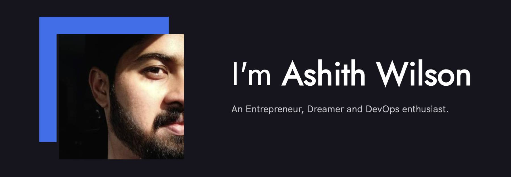

### Hi there! I'm Ashith 👋

  

### 🙋🏽‍♂️About Me

 I wear many hats depending on what is required of me but, I am first and foremost, a passionate learner, a backend engineer, a game programmer, and a DevOps enthusiast! I would really happy to help with anything related to tech. So, feel free to reach out to me to talk about possible opportunities, mentorship, collaborations and everything in between!

### 👨🏽‍💻Tech Stack

Here are a few things I've picked up along my learning journey.

- 🗣 AWS, DigitalOcean
- 🎒 Kubernetes, Docker
- ☁ Python, Bash
- ♽ Chef, Jenkins

### 🚧Current Projects

Check out what I'm currently involved in.

- <a href="https://www.georgebrown.ca/programs/game-programming-program-t163">Multiplayer Systems (T163@GBC)</a> _A course I teach at George Brown College on the topic of multiplayer networking and games._
- <a href="http://skinopathy.com/">Skinopathy</a> | _A machine learning driven, cancer detection app._
- <a href="https://www.heartcade.co/">He♥️rtCade</a> | _An experimental dating app bringing a fresh idea to "swiping right._
- <a href="http://playendboss.com/">Endboss: The CCG </a> | _EndBoss is an online multiple CCG ready to redefine the genre of collectible card games._

### 🌱What I'm Learning

Here are some things on my todo list.

- _Bells and whistles for Kubernetes_ 🧙🏽‍♂️
- _Scaling for speed_ 🤖
- _Practical Reliability Engineering,_ ⚙️
- _Chaos Engineering: How to design to fail_ ☁

Best

<a href="https://ashithwilson.com" target="_blank">_Ashith Wilson_</a>
