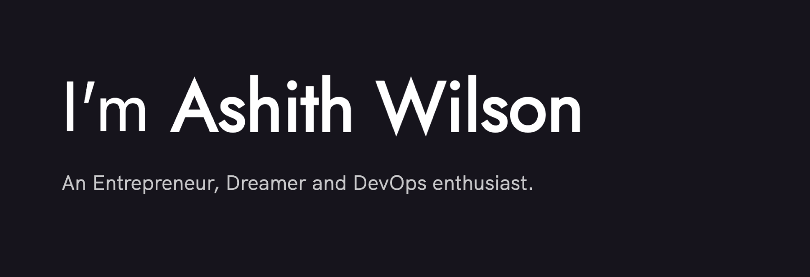

  

### 🙋🏽‍♂️About Me

I'm <b>Ashith 👋</b>
 
An Engineer by profession presently working on some awesome stuff at Cloudera. I wear many hats depending on what is required of me. That said, I'm first and foremost, a passionate learner, an site reliability engineer, and a DevOps enthusiast!

### 👨🏽‍💻Tech Stack

Here are a few things I've picked up along my learning journey.

- 🗣 AWS, DigitalOcean
- 🎒 Kubernetes, Docker
- ☁ Python, Bash
- ♽ Chef, Jenkins

### 🌱What I'm Learning

Here are some things on my todo list.

- _Bells and whistles for Kubernetes_ 🧙🏽‍♂️
- _Scaling for speed_ 🤖
- _Practical Reliability Engineering_ ⚙️
- _Chaos Engineering: Designing to fail_ ☁

### 🎯Also interested in
- Video production, Editing/VFX, WordPress, Digital Marketing, SEO.

I would be really happy to help with anything related to tech. So, feel free to reach out to me to talk about possible opportunities, mentorship, collaborations and everything in between! I also speak at colleges and technical conferences. I'm just an invite away - ashithwilson@gmail.com 

Best.  
Ashith Wilson  
[ashithwilson.com](https://ashithwilson.com/)

